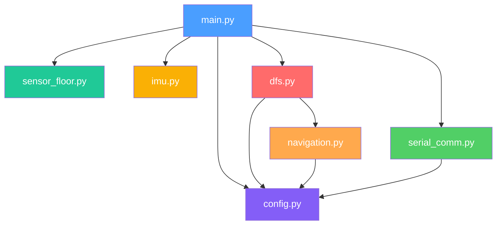

# Documentação Completa do Software — OrangeBots Rescue Maze

> Este documento explica **toda** a estrutura do software do robô, de forma que alguém
> que nunca leu o código consiga compreender o que cada parte faz, como comunica, e porquê.

---

## Índice

1. [Visão Geral da Arquitetura](#1-visão-geral-da-arquitetura)
2. [Estrutura de Ficheiros](#2-estrutura-de-ficheiros)
3. [Protocolo de Comunicação Serial](#3-protocolo-de-comunicação-serial)
4. [Raspberry Pi — Código Python](#4-raspberry-pi--código-python)
   - 4.1 [main.py — Ponto de Entrada](#41-mainpy--ponto-de-entrada)
   - 4.2 [config.py — Constantes Centrais](#42-configpy--constantes-centrais)
   - 4.3 [serial_comm.py — Comunicação Serial](#43-serial_commpy--comunicação-serial)
   - 4.4 [sensor_floor.py — Sensor de Chão](#44-sensor_floorpy--sensor-de-chão)
   - 4.5 [navigation.py — Navegação de Baixo Nível](#45-navigationpy--navegação-de-baixo-nível)
   - 4.6 [dfs.py — Exploração do Labirinto](#46-dfspy--exploração-do-labirinto)
5. [ESP32 — Firmware (v1.ino)](#5-esp32--firmware-v1ino)
   - 5.1 [Hardware Controlado](#51-hardware-controlado)
   - 5.2 [Setup](#52-setup)
   - 5.3 [Loop Principal](#53-loop-principal)
   - 5.4 [Comandos Implementados](#54-comandos-implementados)
   - 5.5 [Compensação Lateral](#55-compensação-lateral)
   - 5.6 [Controlo de Motores](#56-controlo-de-motores)
6. [Fluxo Completo de uma Célula](#6-fluxo-completo-de-uma-célula)
7. [Constantes e Tunning](#7-constantes-e-tunning)

---

## 1. Visão Geral da Arquitetura

O robô usa uma arquitetura de **dois processadores** com responsabilidades claramente separadas:

```
┌─────────────────────────────┐          UART 115200           ┌──────────────────────────┐
│       RASPBERRY PI          │  ◄──────────────────────────►  │         ESP32            │
│                             │     (pinos 16 RX, 17 TX)      │                          │
│  • Decisão (para onde ir)   │                                │  • Execução (motores)    │
│  • Mapeamento (DFS)         │     Protocolo: 2 letras        │  • Encoders              │
│  • IMU (orientação)         │     + argumentos + \n           │  • Ultrassónicos         │
│  • Câmara (vítimas)         │     Resposta: dados + \n       │  • Servo (kit resgate)   │
│  • Sensor de chão (TCS)     │                                │  • Compensação lateral   │
│  • Timer de missão          │                                │    (automática)          │
└─────────────────────────────┘                                └──────────────────────────┘
```

**Princípio fundamental:** O Raspberry Pi é o "cérebro" — toma todas as decisões. O ESP32 é o "sistema nervoso" — executa ordens e reporta sensores. O Pi **nunca** controla pinos GPIO diretamente para motores; envia sempre comandos de texto ao ESP32.

A única exceção é a **compensação lateral**: o ESP32 ajusta automaticamente as velocidades dos motores para evitar colisões com paredes laterais, sem que o Pi o peça. Esta correção é reativa e de curto prazo, complementando a correção de heading do Pi (que é baseada na IMU e de longo prazo).

---

## 2. Estrutura de Ficheiros

```
Robocup/
├── Documentação/
│   ├── Documentação_Software.md          ← este ficheiro
│   ├── Documentação Técnica de Arquitetura de Software.pdf
│   ├── Poster_OrangeBots.pdf
│   ├── RCJRescueMaze2026-final.pdf       ← regras da competição
│   └── TDP_OrangeBots.pdf
│
├── ESP32/
│   └── v1.ino                            ← firmware do microcontrolador
│
└── Raspberry Pi/
    ├── ESP32_SPEC.md                     ← contrato do protocolo serial
    ├── config.py                         ← todas as constantes (fonte única de verdade)
    ├── main.py                           ← ponto de entrada — inicializa tudo
    ├── serial_comm.py                    ← abstração da comunicação serial + simulação
    ├── sensor_floor.py                   ← wrapper do sensor de cor TCS
    ├── navigation.py                     ← movimentos físicos (rodar, avançar, recuar)
    ├── dfs.py                            ← algoritmo de exploração do labirinto
    └── imu.py                            ← módulo da bússola/acelerómetro (não listado)
```

### Relação de dependências entre módulos Python



**Direção dos dados:**
- `main.py` cria todas as instâncias e passa-as ao `dfs.py`
- `dfs.py` chama funções de `navigation.py` para se mover
- `navigation.py` chama `serial_comm.py` para enviar comandos ao ESP32
- `config.py` é importado por todos — nunca importa nada

---

## 3. Protocolo de Comunicação Serial

O Pi e o ESP32 comunicam por UART a **115200 baud**. O protocolo é **request-response**: o Pi envia um comando, e o ESP32 responde. O ESP32 **nunca** envia dados espontaneamente.

### Formato dos comandos

```
Pi envia:    XX[argumentos]\n
ESP32 lê:    2 bytes (comando) + 1 byte (separador) + [argumentos]
ESP32 responde:  dados\n  ou  OK\n
```

- Todos os comandos têm **exatamente 2 letras**.
- Se houver argumentos (como em `MC`), são separados por espaço.
- O ESP32 lê os 2 primeiros bytes como comando, descarta o 3º byte (espaço ou `\n`), e processa argumentos se existirem.

### Tabela de comandos

| Comando | Envio do Pi | Resposta do ESP32 | Descrição |
|---------|------------|-------------------|-----------|
| `PG` | `PG\n` | `OK\n` | Ping — verifica se ESP32 está vivo |
| `MC` | `MC 40 40 40 40\n` | `OK\n` | Define velocidade dos 4 motores (-100 a 100) |
| `SR` | `SR\n` | `12,8,35\n` | Leitura de 3 ultrassónicos: esquerda, frente, direita (cm) |
| `MR` | `MR\n` | `10.5,10.2,10.8,10.3\n` | Leitura de 4 encoders: distância acumulada desde último MZ (cm) |
| `MZ` | `MZ\n` | `OK\n` | Reset dos 4 contadores de encoder a zero |
| `VC` | `VC\n` | `OK\n` | Ativa o servo do kit de resgate (90° → 1s → 0°) |

### Fiabilidade

- O Pi faz `reset_input_buffer()` antes de cada envio (limpa lixo no buffer).
- Se não receber resposta em 2 segundos, faz **retry** (até 3 tentativas).
- Se todas as tentativas falharem, retorna string vazia `""`.
- O ESP32 responde `OK` a comandos desconhecidos (para não bloquear o Pi).

---

## 4. Raspberry Pi — Código Python

### 4.1 `main.py` — Ponto de Entrada

**Ficheiro:** `Raspberry Pi/main.py` · 120 linhas

Este ficheiro é o **único que se executa diretamente**. Ele:

1. **Processa argumentos da linha de comandos:**
   ```
   python main.py --simulate --no-camera     # testes em PC
   python main.py --port /dev/ttyUSB0        # robô real
   python main.py --port COM3 --no-floor     # sem sensor de chão
   ```

2. **Inicializa todos os subsistemas** pela seguinte ordem:
   - `SerialComm` — abre a porta UART para o ESP32
   - Para motores imediatamente (`MC 0 0 0 0`) — segurança em caso de reinício
   - `ping()` — confirma que o ESP32 está a responder
   - `IMU` — inicializa o sensor de orientação
   - `FloorSensor` — inicializa o sensor de cor do chão
   - Câmara + detetores de vítimas (opcional)

3. **Inicia o timer de missão:** o relógio só começa a contar APÓS a inicialização, para não desperdiçar tempo de competição.

4. **Chama `explorar_labirinto()`** — é aqui que o robô começa a andar.

5. **Garante segurança no encerramento:** mesmo que ocorra um crash ou Ctrl+C, o bloco `finally` para os motores, fecha a porta serial, desliga o sensor de chão e para a câmara.

### Modos de execução

| Flag | Efeito |
|------|--------|
| `--simulate` | Não usa porta serial real; o utilizador responde manualmente no terminal |
| `--port PORTA` | Liga ao ESP32 pela porta indicada |
| `--no-camera` | Desativa câmara e deteção de vítimas |
| `--no-floor` | Desativa sensor de chão TCS |

---

### 4.2 `config.py` — Constantes Centrais

**Ficheiro:** `Raspberry Pi/config.py` · 53 linhas

Este ficheiro é a **fonte única de verdade** para todas as constantes do projeto. Nenhum outro ficheiro Python define valores numéricos diretamente — importam todos de `config.py`. Isto permite alterar o comportamento do robô num único local.

#### Direção e mapa

| Constante | Valor | Significado |
|-----------|-------|-------------|
| `NORTH, EAST, SOUTH, WEST` | `0, 1, 2, 3` | IDs dos 4 pontos cardeais |
| `DIRECTION_NAME` | `{0: "Norte", ...}` | Nomes legíveis para debug |
| `DIRECTION_DELTA` | `{NORTH: (0,1), EAST: (1,0), ...}` | Deslocamento (x,y) por direção |
| `DELTA_TO_DIR` | inverso do acima | Converte delta → cardinal |
| `DIRECTION_ANGLE` | `{NORTH: 0.0, EAST: 90.0, ...}` | Ângulo absoluto por cardinal (graus) |

#### Geometria

| Constante | Valor | Significado |
|-----------|-------|-------------|
| `CELL_DISTANCE_CM` | `30.0` | Tamanho de uma célula do labirinto em cm |
| `WALL_THRESHOLD_CM` | `15.0` | Se ultrassónico ≤ 15cm → há parede |
| `DR_POLL_INTERVAL` | `0.01` | Intervalo entre leituras de encoder durante avanço (10ms) |

#### Velocidades

| Constante | Valor | Significado |
|-----------|-------|-------------|
| `MOTOR_SPEED` | `40` | Velocidade base de translação (0-100) |
| `RAMP_SPEED` | `60` | Velocidade ao subir rampa |
| `RAMP_DOWN_SPEED` | `30` | Velocidade controlada ao descer rampa |

#### Heading correction (controlador P via IMU)

| Constante | Valor | Significado |
|-----------|-------|-------------|
| `HEADING_KP` | `0.5` | Ganho proporcional do controlador P |
| `MAX_HEADING_CORR` | `15` | Correção máxima por lado (unidades de velocidade) |
| `HEADING_CORR_INTERVAL` | `5` | Aplica correção a cada N ciclos de encoder |

#### Rotação

| Constante | Valor | Significado |
|-----------|-------|-------------|
| `TURN_TOLERANCE` | `5.0°` | Diferença angular aceitável para considerar rotação concluída |
| `TURN_SLOW_ZONE` | `25.0°` | Abaixo de 25° de diferença → desacelera |
| `TURN_SPEED_FAST` | `35` | Velocidade fora da slow zone |
| `TURN_SPEED_SLOW` | `18` | Velocidade dentro da slow zone |
| `TURN_SETTLED_CYCLES` | `3` | Precisa de 3 leituras consecutivas dentro da tolerância |
| `TURN_TIMEOUT` | `8.0s` | Proteção contra rotação infinita |

#### Rampa

| Constante | Valor | Significado |
|-----------|-------|-------------|
| `RAMP_ENTER_DEG` | `172.0°` | Inclinação abaixo disto → robô está numa rampa |
| `RAMP_EXIT_DEG` | `177.0°` | Inclinação acima disto → rampa concluída |
| `RAMP_TIMEOUT_S` | `6.0s` | Timeout de segurança em rampa |
| `RAMP_CENTERING_CM` | `15.0` | Distância a avançar após nivelar para centrar no tile pós-rampa |
| `RAMP_CENTERING_SPEED` | `30` | Velocidade lenta para centralização pós-rampa |

#### Timer de missão

| Constante | Valor | Significado |
|-----------|-------|-------------|
| `MISSION_TIMEOUT_S` | `450` (7m30s) | Tempo máximo de exploração antes de regressar a (0,0) |
| `BACKTRACK_TIMEOUT_S` | `45s` | Timeout para o regresso a casa |

#### Serial

| Constante | Valor | Significado |
|-----------|-------|-------------|
| `SERIAL_RETRIES` | `3` | Tentativas por comando antes de considerar falha |
| `SERIAL_RETRY_WAIT` | `0.05s` | Pausa entre tentativas |

#### IMU

| Constante | Valor | Significado |
|-----------|-------|-------------|
| `MAG_OFFSET` | `(-7.35, 4.575)` | Calibração de offset do magnetómetro |
| `MAG_SCALE` | `(0.984, 1.016)` | Calibração de escala do magnetómetro |
| `IMU_CALIBRATION_SAMPLES` | `5` | Leituras iniciais para confirmar heading estável |

---

### 4.3 `serial_comm.py` — Comunicação Serial

**Ficheiro:** `Raspberry Pi/serial_comm.py` · 155 linhas

Classe `SerialComm` — abstração que encapsula toda a comunicação com o ESP32.

#### Construtor `__init__(port, baudrate, simulate)`

- Se `simulate=False` (modo real): abre a porta serial com `pyserial`, espera 2 segundos (o ESP32 precisa de tempo para arrancar após reset USB), e imprime confirmação.
- Se `simulate=True`: não abre porta nenhuma. Os comandos são processados internamente pelo simulador.

#### `ping(max_tries=15, interval=2) → bool`

Envia `PG` repetidamente até receber `OK` ou esgotar as tentativas. Usado no arranque para confirmar que o ESP32 está vivo. Tenta até **15 vezes** com **2 segundos** entre tentativas (30 segundos no total) — tempo suficiente para um reset manual.

#### `send(command) → str`

Método principal. Envia um comando e retorna a resposta.

- **Modo real** → chama `_serial_send()`:
  1. Tenta enviar com `_raw_send()`
  2. Se a resposta for vazia (timeout ou erro), faz retry até `SERIAL_RETRIES` vezes
  3. Se todas falharem, retorna `""` e imprime aviso

- **Modo simulação** → chama `_simulate_send()`

#### `_raw_send(command) → str`

Operação atómica de envio e receção:
1. `reset_input_buffer()` — limpa bytes residuais no buffer de entrada
2. Envia `command + "\n"` codificado em UTF-8
3. `flush()` — garante que os bytes saíram do buffer de saída
4. `readline()` — lê até `\n` ou timeout (2 segundos)
5. Decodifica e retorna sem espaços em branco

#### `_simulate_send(command) → str` — Simulador

Quando o código corre num PC sem hardware, este simulador permite testar a lógica:

| Comando | Comportamento da simulação |
|---------|---------------------------|
| `PG` | Retorna `"OK"` |
| `SR` | Pede ao utilizador no terminal: `esq,frente,dir` |
| `MZ` | Reset do encoder simulado para 0 |
| `MR` | Se os motores estão ligados (translação), incrementa 10cm/chamada. Retorna 4 valores iguais. |
| `MC ...` | Analisa as velocidades: todos positivos → a mover; todos negativos → marcha-atrás; misturados → rotação (encoder não incrementa) |
| `VC` | Imprime mensagem de ativação |
| Outro | Retorna `"OK"` |

#### `close()`

Fecha a porta serial se estiver aberta.

---

### 4.4 `sensor_floor.py` — Sensor de Chão

**Ficheiro:** `Raspberry Pi/sensor_floor.py` · 71 linhas

Classe `FloorSensor` — wrapper do sensor de cor TCS3200, com **degradação graciosa**.

#### Filosofia: Stub Pattern

Se o hardware TCS3200 não estiver disponível (porque estamos num PC, ou `pigpio` não está instalado, ou o daemon `pigpiod` não está a correr), o sensor entra automaticamente em **modo stub**:
- `is_preto()` → sempre `False` (o robô nunca é bloqueado por tile preto falso)
- `get_cor()` → sempre `None`

Isto permite que a navegação funcione sem o sensor — simplesmente não deteta tiles especiais.

#### Construtor `__init__(enabled)`

1. Se `enabled=False`, entra em modo stub imediatamente (mensagem no terminal).
2. Senão, tenta:
   - Importar `pigpio` e `sensor_cor`
   - Ligar ao daemon `pigpiod`
   - Criar o sensor nos pinos GPIO (OUT=24, S2=22, S3=23, S0=4, S1=17, OE=18)
   - Configurar frequência e tamanho de amostra
3. Se qualquer passo falhar → modo stub (com mensagem descritiva).

#### `is_preto() → bool`

Pergunta ao sensor se a cor atual é preta. Usado pelo `navigation.py` durante o avanço — se detetar preto, o robô para e recua. Retorna `False` em modo stub (seguro por defeito).

#### `get_cor() → str | None`

Retorna a cor detetada como string (`"preto"`, `"azul"`, `"verde"`, etc.) ou `None` em modo stub. Usado pelo `dfs.py` para identificar tiles azuis.

#### `close()`

Desliga o daemon `pigpiod` se estiver ligado.

---

### 4.5 `navigation.py` — Navegação de Baixo Nível

**Ficheiro:** `Raspberry Pi/navigation.py` · 285 linhas

Este módulo traduz intenções de alto nível ("avança uma célula para Norte") em sequências de comandos seriais e leituras de sensores. É o módulo mais complexo do Pi.

#### Funções utilitárias

##### `angle_diff(target, current) → float`

Calcula a diferença angular entre dois ângulos no intervalo **[-180°, +180°]**.

- Resultado positivo → precisa virar para a **direita**
- Resultado negativo → precisa virar para a **esquerda**
- Exemplo: `angle_diff(90, 350) → +100°` (virar direita); `angle_diff(0, 45) → -45°` (virar esquerda)

Essencial para rotação e heading correction — sem esta função, comparar 350° com 10° daria 340° em vez de 20°.

##### `_robust_distance(encoder_vals) → float`

Calcula a distância percorrida de forma robusta usando a **mediana** dos 4 encoders. Se uma roda patinar (valor anómalo), a mediana ignora esse valor sem distorcer a leitura. Valores abaixo de -2cm são descartados (tolerância de ruído).

##### `_parse_encoder(response) → list[float] | None`

Converte a string de resposta do ESP32 (ex: `"10.5,10.2,10.8,10.3"`) numa lista de 4 floats. Retorna `None` se o parse falhar (resposta corrompida, vazia, etc.).

---

#### `turn_to(target_cardinal, serial, imu) → bool` — Rotação

Roda o robô até ficar virado para um ponto cardinal absoluto, usando a IMU como referência.

**Algoritmo passo a passo:**

```
1. Calcula o ângulo-alvo (ex: EAST → 90°)
2. Loop:
   a. Se timeout (8s) → para motores, retorna False
   b. Lê heading atual da IMU
   c. Calcula diferença angular (angle_diff)
   d. Se |diff| ≤ tolerância (5°):
      - Incrementa contador "settled"
      - Se settled ≥ 3 → rotação concluída, sai do loop
   e. Se o sinal da diferença mudou (era positivo, agora negativo):
      - Overshoot detetado → para e aceita posição atual
   f. Escolhe velocidade:
      - |diff| > 25° → TURN_SPEED_FAST (35)
      - |diff| ≤ 25° → TURN_SPEED_SLOW (18)
   g. Envia MC com motores em sentidos opostos:
      - Virar direita: MC -v +v -v +v
      - Virar esquerda: MC +v -v +v -v
   h. Espera 20ms
3. Para motores, espera 100ms para estabilizar
```

**Características de segurança:**
- **Slow zone:** desacelera ao aproximar do alvo para reduzir overshoot
- **Settled count:** exige 3 leituras consecutivas dentro da tolerância, não apenas uma (filtra oscilações)
- **Deteção de overshoot:** se o robô ultrapassar o alvo sem entrar na tolerância, aceita a posição atual em vez de oscilar
- **Timeout de 8s:** se nada funcionar, para e devolve falha

---

#### `move_forward(serial, imu, floor_sensor, cardinal) → str` — Avanço

Avança exatamente uma célula (30cm por defeito). Retorna `"OK"`, `"BLACK"`, `"RAMP_UP"` ou `"RAMP_DOWN"`.

**Algoritmo passo a passo:**

```
1. Reseta encoders (MZ)
2. Liga motores para a frente (MC SPEED SPEED SPEED SPEED)
3. Loop (a cada 10ms):
   a. Verifica sensor de chão:
      - Se tile preto → para, recua a distância já percorrida, retorna "BLACK"
   b. A cada 3 ciclos, verifica inclinação (IMU):
      - Se inclinação ≤ 172° → detetou rampa, chama _traverse_ramp()
   c. A cada 5 ciclos, aplica heading correction (controlador P):
      - Lê heading da IMU
      - Calcula erro angular
      - Ajusta velocidade esquerda/direita proporcionalmente ao erro
      - Limita correção a ±15 unidades
   d. Lê encoders (MR)
   e. Calcula distância percorrida (mediana dos 4 encoders)
   f. Se distância ≥ 30cm → sai do loop
4. Para motores
5. Retorna "OK"
```

**Heading correction — como funciona:**

Durante o avanço em linha reta, vibrações e irregularidades fazem o robô desviar gradualmente da direção pretendida. O controlador P corrige isto:

```
erro = ângulo_alvo - heading_atual (via IMU)
correção = HEADING_KP × erro  (limitada a ±15)

Se erro > 0 (desviou para a esquerda, precisa virar direita):
  esquerda = MOTOR_SPEED - correção (mais lenta)
  direita  = MOTOR_SPEED + correção (mais rápida)

Se erro < 0 (desviou para a direita):
  esquerda = MOTOR_SPEED + |correção|
  direita  = MOTOR_SPEED - |correção|
```

> **Nota:** Esta correção é feita pelo Pi (baseada na IMU, longo prazo) e é **complementar** à compensação lateral do ESP32 (baseada nos ultrassónicos, curto prazo, evita colisões com paredes).

---

#### `move_to_direction(current_dir, target_dir, serial, imu, floor_sensor) → (heading, response)`

Wrapper de alto nível chamado pelo DFS. Combina rotação + avanço + verificação de drift.

```
1. Se current_dir ≠ target_dir → chama turn_to() para rodar
2. Chama move_forward() para avançar uma célula
3. Se o avanço foi "OK":
   a. Lê heading atual da IMU
   b. Se drift > 10° → chama turn_to() para corrigir
4. Se o avanço foi "RAMP_UP" ou "RAMP_DOWN":
   - Não faz drift check (a centralização pós-rampa já cuida do alinhamento)
5. Retorna (novo_heading, response)
   - Respostas possíveis: "OK", "BLACK", "RAMP_UP", "RAMP_DOWN"
```

---

#### Funções auxiliares internas

##### `_apply_heading_correction(serial, imu, target_heading)`

Aplica uma única correção P de heading. Chamada periodicamente durante `move_forward()`. Se a correção for < 2 unidades, é ignorada (evita jitter nos motores).

##### `_reverse_by(serial, distance)`

Recua o robô exatamente `distance` cm. Usado após deteção de tile preto. Processo:
1. Reset encoders (MZ)
2. Liga motores para trás
3. Lê encoders a cada 10ms até percorrer a distância
4. Timeout de 5 segundos como segurança

##### `_traverse_ramp(serial, imu) → "RAMP_UP" | "RAMP_DOWN"`

Deteta a rampa pela inclinação. A subida (`RAMP_UP`) usa `RAMP_SPEED` e a descida (`RAMP_DOWN`) usa `RAMP_DOWN_SPEED` para manter o controlo. Ao terminar, realiza a centralização automática no tile seguinte (usando `RAMP_CENTERING_CM`), garantindo que o robô inicia a próxima célula no centro exato.

---

### 4.6 `dfs.py` — Exploração do Labirinto

**Ficheiro:** `Raspberry Pi/dfs.py` · 308 linhas

Este módulo implementa o **algoritmo DFS (Depth-First Search) iterativo** para explorar sistematicamente todo o labirinto. É a lógica de mais alto nível do robô.

#### Conceito: DFS para labirintos

O DFS explora o labirinto como uma árvore:
1. Em cada célula, identifica as direções livres (sem parede)
2. Tenta a primeira opção disponível
3. Se chegar a um beco sem saída (todas as direções já visitadas ou bloqueadas), faz **backtracking** — volta à célula anterior e tenta a próxima opção
4. A exploração termina quando todas as células alcançáveis foram visitadas

O DFS usa uma **pilha (stack)** em vez de recursão para ser mais eficiente em memória e evitar stack overflow.

#### Estruturas de dados

```python
stack    = [(0,0,0)]    # Pilha do caminho atual — topo = posição atual (x, y, z)
visited  = {(0,0,0)}    # Conjunto de células já visitadas (3D)
cell_map = {}           # {posição: [opções restantes]} — mapa do labirinto
blocked  = set()        # Tiles pretos (nunca se entra lá)
blue_tiles = []         # Tiles azuis encontrados
victims  = []           # Vítimas detetadas: [(pos, tipo, valor, kits)]
```

> **Nota:** As posições usam tuplas 3D `(x, y, z)` onde `z` representa o andar (0 = térreo, 1 = primeiro andar, etc.). Isto permite que o DFS explore múltiplos andares do labirinto sem colisão de coordenadas. A coordenada `z` é incrementada quando o robô sobe uma rampa (`RAMP_UP`) e decrementada quando desce (`RAMP_DOWN`).

#### Helpers de geometria

##### `relative_to_absolute(heading, relative) → int`

Converte uma direção relativa ao robô (`"front"`, `"right"`, `"left"`, `"back"`) para um cardinal absoluto (`NORTH`, `EAST`, etc.), baseado no heading atual.

```
Exemplo: heading=EAST, relative="right" → SOUTH
         heading=NORTH, relative="front" → NORTH
```

##### `direction_between(from_pos, to_pos) → int`

Calcula o cardinal necessário para ir de uma célula para outra adjacente. **Ignora a coordenada `z`** — a direção física é determinada apenas por `(x, y)`.

```
Exemplo: (0,0,0) → (1,0,0) → EAST
         (2,3,1) → (2,2,1) → SOUTH
         (0,1,0) → (0,2,1) → NORTH  (a mudança de z é ignorada)
```

#### `read_walls(heading, serial) → dict | None`

Lê os ultrassónicos (comando `SR`) e converte para um dicionário de paredes absolutas:

```python
# Exemplo com heading=NORTH:
# SR responde "10,5,40" → esq=10cm, frente=5cm, dir=40cm
# Com WALL_THRESHOLD=15cm:
{
    NORTH: True,   # frente: 5cm ≤ 15cm → PAREDE
    EAST:  False,  # direita: 40cm > 15cm → livre
    SOUTH: False,  # trás: sempre livre (viemos de lá)
    WEST:  True,   # esquerda: 10cm ≤ 15cm → PAREDE
}
```

#### `explorar_labirinto()` — Função principal

**Parâmetros:** recebe todas as instâncias criadas pelo `main.py` — serial, imu, floor sensor, câmara, detetores de vítimas, flag de câmara, e deadline da missão.

**Algoritmo em 3 fases por iteração:**

```
INICIALIZAÇÃO:
  - Calibra heading inicial (IMU, 5 leituras, usa a moda)
  - Imprime estado inicial

LOOP PRINCIPAL (enquanto houver stack):

  VERIFICA TIMER:
    Se tempo esgotado → _return_to_start() → sai do loop

  FASE A — Sensoriamento (só na 1ª visita à célula):
    1. Lê paredes (SR) — até 3 tentativas
    2. Imprime mapa de paredes
    3. Verifica cor do chão (tile azul)
    4. Deteta vítimas (câmara, se ativa)
    5. Monta lista de opções por prioridade: frente > direita > esquerda > trás

  FASE B — Movimento DFS:
    1. Pega a próxima opção da lista
    2. Se a célula-alvo já foi visitada ou é preta → tenta a próxima
    3. Chama move_to_direction() para ir lá
    4. Se resposta="BLACK" → marca como bloqueada, tenta próxima
    5. Se resposta="OK" → adiciona à stack com z atual, marca como visitada
    6. Se resposta="RAMP_UP" → adiciona à stack com z+1, marca como visitada
    7. Se resposta="RAMP_DOWN" → adiciona à stack com z-1, marca como visitada

  FASE C — Backtracking:
    Se não há mais opções para esta célula:
    1. Remove a célula atual da stack (pop)
    2. Calcula a direção para a célula anterior
    3. Move-se de volta (move_to_direction)

RELATÓRIO FINAL:
  Imprime estatísticas: células visitadas, tiles bloqueados, tiles azuis, vítimas
```

#### Prioridade de exploração

A ordem de exploração dentro de cada célula é: **frente > direita > esquerda > trás**. Isto significa que o robô tende a seguir em frente quando possível (menos rotações), depois tenta a direita, depois a esquerda, e só recua em último recurso.

#### `_calibrate_initial_heading(imu) → int`

No arranque, o robô não sabe para onde está virado. Esta função:
1. Calibra o norte magnético (`imu.calibrate_north()`)
2. Lê a IMU 5 vezes
3. Usa a **moda** (valor mais frequente) como heading inicial — mais robusto que uma única leitura
4. Se tudo falhar, assume NORTE

#### `_return_to_start(stack, heading, serial, imu, floor_sensor) → int`

Quando o timer expira, percorre a pilha ao contrário para regressar a (0,0,0). A pilha contém exatamente o caminho que o robô percorreu (incluindo transições de andar), logo o inverso é o caminho de volta. Tem um timeout de 45 segundos para o regresso.

#### `_read_walls_reliable(heading, serial) → dict | None`

Tenta ler paredes até 3 vezes. Se falhar 3 vezes consecutivas, retorna `None` e a exploração aborta (falha crítica de sensor).

---

## 5. ESP32 — Firmware (v1.ino)

**Ficheiro:** `ESP32/v1.ino` · 295 linhas

O ESP32 é programado em C++ usando o framework Arduino. Ele controla diretamente todo o hardware elétrico/mecânico do robô.

### 5.1 Hardware Controlado

#### 4 Motores DC com H-Bridge

Cada motor tem dois pinos:

| Motor | Posição | Pino PWM (velocidade) | Pino DIR (direção) | Pino Encoder |
|-------|---------|-----------------------|--------------------| -------------|
| 0 | Frente-Esquerda | GPIO 25 | GPIO 26 | GPIO 35 |
| 1 | Frente-Direita | GPIO 4 | GPIO 5 | GPIO 34 |
| 2 | Trás-Esquerda | GPIO 18 | GPIO 14 | GPIO 39 |
| 3 | Trás-Direita | GPIO 32 | GPIO 33 | GPIO 36 |

- **PWM:** 25 kHz, resolução de 8 bits (0-255). Usa PWM invertido: 0 = velocidade máxima, 255 = parado.
- **DIR:** HIGH ou LOW para definir sentido de rotação.
- **Encoders:** pinos de entrada que geram pulsos conforme o motor roda. Cada pulso ≈ 0.756 cm de deslocamento.

> **Inversão de direção:** Os motores do lado direito (1, 3) estão montados em espelho em relação aos do lado esquerdo (0, 2). Por isso, a lógica do pino de direção é invertida para eles.

#### 4 Sensores Ultrassónicos HC-SR04

| Sensor | Direção | Pino TRIG | Pino ECHO |
|--------|---------|-----------|-----------|
| sonicLeft | Esquerda | GPIO 21 | GPIO 19 |
| sonicFront | Frente | GPIO 12 | GPIO 13 |
| sonicRight | Direita | GPIO 23 | GPIO 22 |
| sonicBack | Trás | GPIO 2 | GPIO 15 |

O sensor traseiro (`sonicBack`) não é usado ativamente — o Pi assume que trás está sempre livre (veio de lá). Os sensores laterais (`sonicLeft`, `sonicRight`) são usados pela compensação lateral do ESP32. O frontal (`sonicFront`) é lido pelo Pi via comando `SR`.

#### 1 Servomotor (kit de resgate)

- **Pino:** GPIO 27
- **Frequência:** 50 Hz (padrão servo)
- **Gama:** 500-2400 μs (0° a 180°)
- **Posição de repouso:** 0°
- **Ativação (VC):** vai a 90°, espera 1 segundo, volta a 0°

#### 2 Portas Serial

| Serial | Uso | Velocidade | Pinos |
|--------|-----|------------|-------|
| `Serial` (USB) | Debug (Serial Monitor) | 115200 baud | USB nativo |
| `piSerial` (UART2) | Comunicação com Raspberry Pi | 115200 baud | RX=GPIO 16, TX=GPIO 17 |

---

### 5.2 Setup

A função `setup()` executa uma vez no arranque e inicializa tudo:

1. **Portas serial:** abre USB (115200) e UART2 (115200, 8N1, pinos 16/17). Define timeout de 200ms para `parseInt()` — evita bloqueio se o Pi enviar dados incompletos.

2. **Pinos de encoder:** configura os 4 pinos como INPUT e liga interrupções `RISING` a cada um. As funções de interrupção (`countPulse1..4`) são marcadas com `IRAM_ATTR` para correr da RAM rápida — crítico para não perder pulsos a alta velocidade.

3. **Servo:** configura a 50Hz, attach no pino 27, posição inicial 0°.

4. **Motores:** configura PWM a 25kHz/8bits em cada pino de velocidade, e cada pino de direção como OUTPUT. Envia velocidade 0 a todos.

---

### 5.3 Loop Principal

A função `loop()` corre continuamente e faz duas coisas:

#### 1. Compensação lateral (a cada 200ms)

```cpp
if (millis() - lastCompTime >= COMP_INTERVAL) {
    updateCompensation();    // Lê sonics laterais, calcula compensação
    if (isTranslating())     // Só aplica se todos os motores vão no mesmo sentido
        applyMotorsWithComp();
    lastCompTime = millis();
}
```

Esta compensação corre **independentemente** dos comandos do Pi. É puramente reativa — impede que o robô bata nas paredes enquanto avança.

#### 2. Processamento de comandos

```cpp
// Verifica se há dados disponíveis
if (piSerial.available())
    activeSerial = &piSerial;        // Prioridade ao Pi
else if (Serial.available())
    activeSerial = &Serial;          // USB para debug
else
    return;                          // Nada para ler → sai do loop

// Lê comando: 2 letras + descarta separador
mode += (char)activeSerial->read();  // 1ª letra
mode += (char)activeSerial->read();  // 2ª letra
activeSerial->read();                // descarta espaço ou \n

// Processa comando (switch implícito com if/else)
// ...

// Flush de bytes residuais (segurança)
while (activeSerial->available()) {
    if (activeSerial->read() == '\n') break;
}
```

O `activeSerial` é um ponteiro que aponta para a serial que recebeu o comando. Isso permite que as respostas voltem pela mesma serial que enviou o comando — se o comando veio do Pi, a resposta vai para o Pi; se veio do USB (debug), a resposta vai para o USB.

---

### 5.4 Comandos Implementados

#### `PG` — Ping

```
Recebe: PG\n
Responde: OK\n
```

Simplesmente responde OK. Usado pelo Pi no arranque para verificar conectividade.

#### `MC` — Motor Control

```
Recebe: MC 40 40 40 40\n
Responde: OK\n
```

1. Lê 4 inteiros com `parseInt()` (que salta automaticamente espaços)
2. Limita cada valor ao intervalo [-100, +100] com `constrain()`
3. Guarda no array global `speeds[]`
4. Se o robô está em translação → aplica compensação lateral em cima dos valores recebidos
5. Se está parado ou a rodar → aplica os valores diretamente (sem compensação)
6. Responde `OK`

O array `speeds[]` é persistente — a compensação lateral usa-o como base entre comandos MC.

#### `SR` — Sensor Reading

```
Recebe: SR\n
Responde: 12,8,35\n
```

Lê 3 sensores ultrassónicos (esquerda, frente, direita) e envia os valores em cm separados por vírgulas. O sensor traseiro **não é incluído** na resposta.

> **Nota de timing:** Cada leitura ultrassónica demora ~30ms (dependendo da distância). Ler 3 sensores pode demorar ~90ms. O Pi aguarda.

#### `MR` — Motor Read (encoders)

```
Recebe: MR\n
Responde: 10.5,10.2,10.8,10.3\n
```

Converte os pulsos acumulados de cada encoder em cm usando o fator `0.756 cm/pulso`, e envia 4 valores separados por vírgulas. **Sem ângulo** — o Pi calcula orientação pela IMU.

Os valores são acumulados desde o último `MZ`. Se nunca foi enviado MZ, são acumulados desde o arranque.

#### `MZ` — Motor/encoder Zero

```
Recebe: MZ\n
Responde: OK\n
```

Reseta os 4 contadores de pulsos a zero. Chamado pelo Pi antes de cada movimento para que os valores de MR representem a distância percorrida nesse movimento específico.

#### `VC` — Victim Confirmed

```
Recebe: VC\n
Responde: OK\n (após ~1 segundo)
```

Ativa o servo: 0° → 90° → espera 1s → 0°. Usado para depositar o kit de resgate junto a uma vítima. O `delay(1000)` bloqueia o ESP32 durante 1 segundo — nenhum outro comando é processado nesse período.

#### Comando desconhecido

Qualquer comando não reconhecido recebe `OK\n` como resposta. Isto evita que o Pi fique preso a esperar uma resposta que nunca vem.

---

### 5.5 Compensação Lateral

A compensação lateral é um sistema automático que ajusta as velocidades dos motores para evitar que o robô colida com paredes laterais enquanto avança. Opera **independentemente** dos comandos do Pi.

#### `isTranslating() → bool`

Verifica se todos os motores estão a girar no mesmo sentido. Retorna `true` apenas em translação pura (todos positivos ou todos negativos). Retorna `false` se:
- Os motores estão parados (todos a zero)
- Os motores estão em rotação (sentidos opostos, como -35 +35 -35 +35)

A compensação **nunca** é aplicada durante rotação — distorceria o ângulo de viragem.

#### `updateCompensation()`

Lê os sensores ultrassónicos laterais (esquerdo e direito) e calcula os valores de compensação em **cache**:

```
Se distância_esquerda ≤ 10cm:
    compensação_esquerda = (10 - distância_esquerda) × 1.5
Senão:
    compensação_esquerda = 0

(Mesma lógica para a direita)
```

**Fórmula invertida:** Quanto **mais perto** da parede, **maior** a compensação. A 1cm de distância, a compensação é `(10-1) × 1.5 = 13.5`. A 10cm, é `(10-10) × 1.5 = 0`.

Os valores são guardados em `cachedLeftComp` e `cachedRightComp` e reutilizados até à próxima atualização (200ms depois).

#### `applyMotorsWithComp()`

Aplica a compensação em cache sobre as velocidades comandadas pelo Pi:

```
Para cada motor:
    Se é motor esquerdo (0, 2) → usa compensação esquerda
    Se é motor direito  (1, 3) → usa compensação direita

    Se motor vai para a frente → soma compensação (acelera)
    Se motor vai para trás    → subtrai compensação

    Resultado limitado a [-100, +100]
```

**Lógica:** Se o robô está perto da parede **esquerda**, os motores **esquerdos** aceleram → o robô vira ligeiramente para a **direita** → afasta-se da parede esquerda.

#### Interação com o Pi

1. O Pi envia `MC 38 42 38 42` (com heading correction via IMU)
2. O ESP32 guarda `speeds = [38, 42, 38, 42]` e aplica com compensação
3. 200ms depois, o ESP32 relê os sonics e reaplica compensação sobre os mesmos `speeds[]`
4. Quando o Pi envia um novo MC, `speeds[]` é atualizado e a compensação é reaplicada imediatamente

As duas correções são complementares:
- **Pi (IMU):** correção de heading — mantém rumo a longo prazo
- **ESP32 (ultrassónicos):** evita colisão lateral — reação de curto prazo

---

### 5.6 Controlo de Motores

#### `setMotorSpeed(int velocidades[])`

Função de mais baixo nível — traduz percentagens (-100 a +100) em sinais elétricos.

**Para cada motor:**

1. **Calcula direção:** os motores do lado direito (1, 3) têm lógica invertida porque estão montados em espelho:
   ```
   Motores esquerdos (0, 2): velocidade > 0 → inv = true  → DIR = HIGH → frente
   Motores direitos  (1, 3): velocidade > 0 → inv = false → DIR = LOW  → frente
   ```

2. **Calcula PWM:** `map(|velocidade|, 0, 100, 255, 0)`
   - Velocidade 0% → PWM 255 (motor parado)
   - Velocidade 100% → PWM 0 (motor a velocidade máxima)
   - Este mapeamento invertido é característico de certos drivers H-Bridge onde PWM baixo = mais potência

3. **Aplica:**
   - `digitalWrite(dirpins[i], inv ? HIGH : LOW)` — define sentido
   - `ledcWrite(speedpins[i], mappedSpeed)` — define velocidade PWM

#### Encoders e interrupções

Os encoders geram pulsos eléctricos conforme o motor roda. O ESP32 conta esses pulsos usando **interrupções de hardware**:

```cpp
void IRAM_ATTR countPulse1() { pulseCount[0]++; }
```

- `IRAM_ATTR` garante que a função está na RAM rápida (não na Flash) — essencial para ISRs no ESP32
- `RISING` significa que a interrupção dispara na transição LOW→HIGH do sinal do encoder
- `volatile` no array `pulseCount[]` indica ao compilador que o valor pode mudar a qualquer momento (dentro de uma interrupção)
- A conversão para cm é `pulseCount × 0.756` (depende do diâmetro da roda e resolução do encoder)

---

## 6. Fluxo Completo de uma Célula

Este é o fluxo completo do que acontece quando o robô chega a uma nova célula e decide para onde ir:

```
┌─────────────────────────────────────────────────────────────────┐
│ 1. DFS: O robô está em (2,1,0), heading=NORTH                   │
│    → É a 1ª visita a esta célula                                │
├─────────────────────────────────────────────────────────────────┤
│ 2. LEITURA DE PAREDES                                           │
│    Pi envia: SR\n                                               │
│    ESP32 lê 3 sonics: esq=35, frente=8, dir=40                 │
│    ESP32 responde: 35,8,40\n                                    │
│    Pi converte: NORTH=PAREDE (8≤15), EAST=livre, WEST=livre     │
├─────────────────────────────────────────────────────────────────┤
│ 3. DFS: Monta opções (prioridade frente>dir>esq>trás)           │
│    Frente (NORTH): PAREDE → descartada                          │
│    Direita (EAST): livre, (3,1) não visitado → opção #1         │
│    Esquerda (WEST): livre, (1,1) não visitado → opção #2        │
│    Trás (SOUTH): livre, (2,0) JÁ VISITADO → descartada          │
│    → Tenta EAST primeiro                                        │
├─────────────────────────────────────────────────────────────────┤
│ 4. ROTAÇÃO (NORTH → EAST)                                      │
│    Pi calcula: angle_diff(90°, ~0°) = +90° → virar direita      │
│    Pi envia: MC -35 35 -35 35\n (rotação)                       │
│    ESP32 aplica (sem compensação — é rotação)                    │
│    ...loop IMU até heading ≈ 90° (±5°, 3× confirmado)           │
│    Pi envia: MC 0 0 0 0\n (para)                                │
├─────────────────────────────────────────────────────────────────┤
│ 5. AVANÇO (1 célula para EAST)                                  │
│    Pi envia: MZ\n → ESP32 reseta encoders → OK                  │
│    Pi envia: MC 40 40 40 40\n → motores a andar → OK            │
│                                                                 │
│    Loop a cada 10ms:                                            │
│    ┌──────────────────────────────────────────────────────┐     │
│    │ Pi: floor.is_preto()? → False                       │     │
│    │ Pi: IMU inclinação ok? → Sim (não é rampa)          │     │
│    │ Pi: heading correction? (a cada 5 ciclos)           │     │
│    │     heading=92°, alvo=90°, erro=+2° → correção=1    │     │
│    │     Pi envia: MC 39 41 39 41\n                      │     │
│    │ Pi: MR\n → ESP32 responde: 8.3,8.1,8.5,8.2\n       │     │
│    │ Pi: mediana([8.3,8.1,8.5,8.2]) = 8.25cm < 30cm     │     │
│    │                                                     │     │
│    │ [Entretanto no ESP32, a cada 200ms]:                 │     │
│    │ ESP32 lê sonicLeft=6cm, sonicRight=25cm              │     │
│    │ compEsq = (10-6)×1.5 = 6.0                         │     │
│    │ compDir = 0 (25 > 10)                               │     │
│    │ Motores: [39+6, 41+0, 39+6, 41+0] = [45,41,45,41]  │     │
│    └──────────────────────────────────────────────────────┘     │
│    ... (repete até mediana ≥ 30cm) ...                          │
│                                                                 │
│    Pi envia: MC 0 0 0 0\n (para)                                │
│    move_forward retorna "OK"                                    │
├─────────────────────────────────────────────────────────────────┤
│ 6. DRIFT CHECK                                                  │
│    Pi lê IMU: heading=88°, alvo=90°, drift=2° < 10°             │
│    → Sem correção necessária                                    │
├─────────────────────────────────────────────────────────────────┤
│ 7. DFS: Posição atualizada para (3,1,0)                         │
│    visited = {..., (3,1,0)}                                      │
│    stack = [..., (2,1,0), (3,1,0)]                               │
│    → Volta ao passo 1 para a nova célula                         │
└─────────────────────────────────────────────────────────────────┘
```

---

## 7. Constantes e Tunning

Todas as constantes ajustáveis num só local:

| Grupo | Constante | Valor | Onde afeta | Como ajustar |
|-------|-----------|-------|------------|--------------|
| **Mapa** | `CELL_DISTANCE_CM` | 30.0 | Avanço (navigation.py) | Medir célula real com régua |
| **Mapa** | `WALL_THRESHOLD_CM` | 15.0 | Deteção de paredes (dfs.py) | Se falha paredes → aumentar; se deteta paredes falsas → diminuir |
| **Motores** | `MOTOR_SPEED` | 40 | Velocidade de cruzeiro | Mais alto = mais rápido mas menos preciso |
| **Motores** | `RAMP_SPEED` | 60 | Velocidade em subida de rampa | Precisa de potência extra para subir |
| **Motores** | `RAMP_DOWN_SPEED` | 30 | Velocidade em descida de rampa | Velocidade controlada para descer com segurança |
| **Heading** | `HEADING_KP` | 0.5 | Agressividade da correção | Mais alto = corrige mais rápido mas pode oscilar |
| **Heading** | `MAX_HEADING_CORR` | 15 | Limite da correção | Evita que a correção pare um motor |
| **Rotação** | `TURN_TOLERANCE` | 5.0° | Precisão da rotação | Mais baixo = mais preciso mas pode não convergir |
| **Rotação** | `TURN_SLOW_ZONE` | 25.0° | Zona de desaceleração | Mais alto = desacelera mais cedo (mais suave) |
| **Rotação** | `TURN_SPEED_FAST/SLOW` | 35/18 | Velocidades de rotação | Ajustar se overshooting ou muito lento |
| **Comp. lateral** | `sideCompGain` (ESP32) | 1.5 | Força da compensação | Mais alto = mais agressivo a afastar de paredes |
| **Comp. lateral** | `sideCompThreshold` (ESP32) | 10cm | Distância de ativação | Mais alto = começa a corrigir mais longe |
| **Rampa** | `RAMP_ENTER_DEG` | 172° | Sensibilidade de deteção | Se não deteta rampa → aumentar |
| **Rampa** | `RAMP_CENTERING_CM` | 15.0cm | Distância pós-rampa para centrar | Ajustar se parar fora do centro do tile |
| **Rampa** | `RAMP_CENTERING_SPEED` | 30 | Velocidade de centralização | Mais baixo = mais preciso mas mais lento |
| **Serial** | `DR_POLL_INTERVAL` | 10ms | Frequência de leitura encoder | Mais baixo = mais responsivo mas mais tráfego serial |
| **Missão** | `MISSION_TIMEOUT_S` | 450s | Tempo de exploração | Depende das regras da competição |
